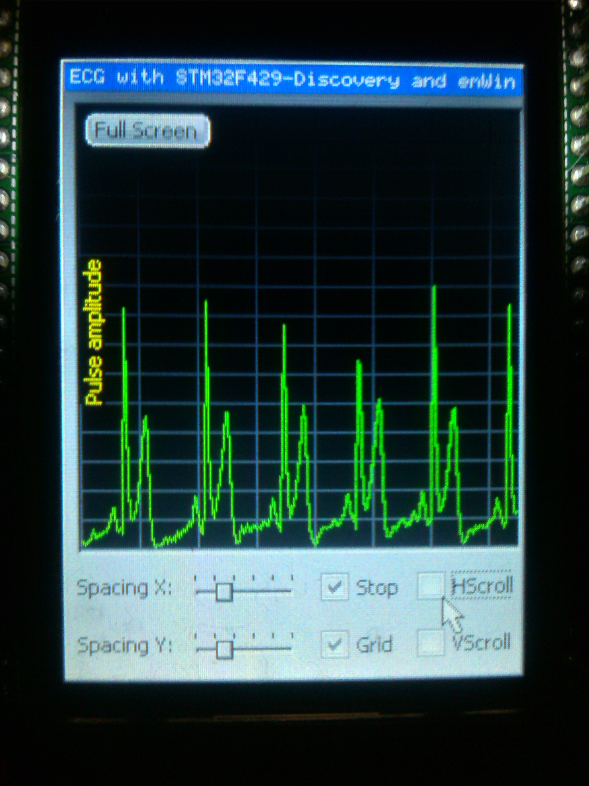

ECG_STM32F429
=============

ECG Project using STM32F429 Discovery and emWin Graphical interface 
The ECG circuit implemented by 2 chip
1xAD623 Instrumentation amplifier for ECG amplification 
1xAD8092 OpAmp AD8092(2in1 Package), 1st amp for voltage follower to drive Vref of AD623
and the second for the next amplification to drive the ADC of STM32.
Circuit Voltage @ 3Volt Current consumption less than 10mA. 
Overall circuit current consumption including Discovery board ~200-250mA.
Discovery board powered by LM7805V(5V*0.25A=1.25W Maximum Power Consumption).
RG(Pin 1 to Pin8)=1.01KOhm amplification ratio of 100.
Vref(Pin 5)=0.9V by voltage divider buffer from AD8092.
Non inverting input(Pin 3)=47Kohm this goes to left leg or Left side of waist .
Inverting Input(Pin 2)=47Kohm this goes to Right side of your neck Electrode.
Ground Electrode goes to right leg or right side of your waist.

Aplified ecg pin output pin 6 to non inverting amplfier, with amplification radio of 4

